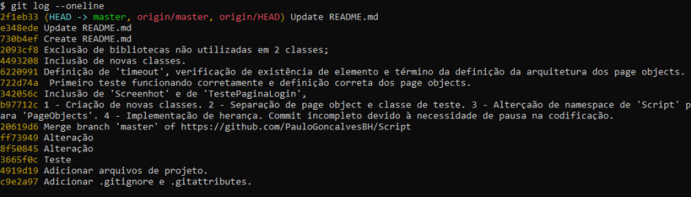
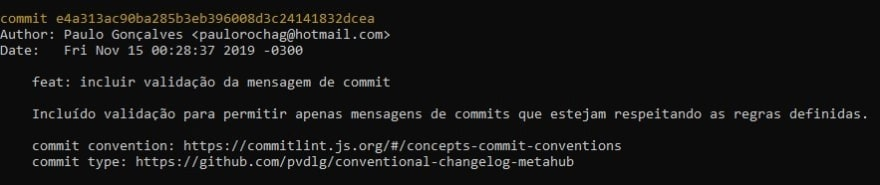
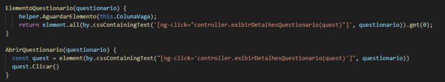
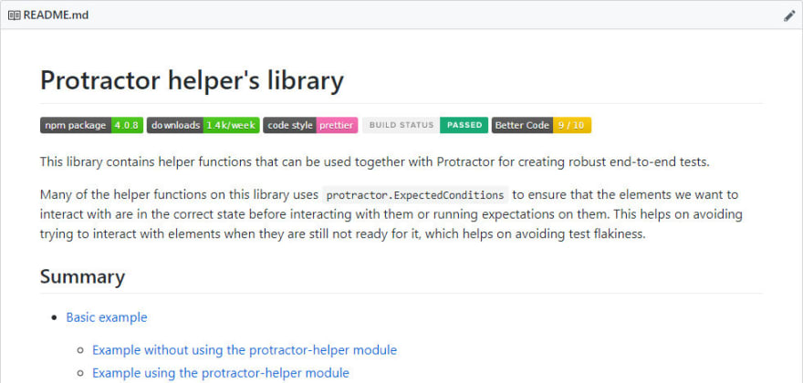

<!--- Acima está o cabeçalho, com as informações do seu post, edite-as de acordo com sua necessidade. Para saber mais: https://dev.to/p/editor_guide
Apague tudo que está abaixo dessa linha e escreva seu post --->

> _Deficiente visual: Se você sentir alguma dificuldade ao ler as imagens desse post com o leitor de tela, me informe que irei melhorar com seu apoio. Pode ser via e-mail (paulorochag@hotmail.com) ou na seção de discussão mais abaixo._

Quando pensamos em automação de testes, muitas vezes passa pela nossa cabeça questões como pirâmide de testes e qual linguagem/framework será utilizado para realizar a automação. Caso seja levado em conta boas práticas de automação, não passamos da discussão de adotar page objects ou page actions na automação de interface.

Porém, é importante atentarmos que há muitos outros fatores determinantes para a manutenção daquela automação por membros da equipe, afinal, quem nunca trocou trechos de código via chat ou teve dificuldade para saber porque que uma determinada alteração foi realizada na automação? 

É importante preocuparmos mais com o nosso código, afinal...
### Código de teste é software e deve ser tratado como tal

E vamos ser sinceros, assim como o dev deve entregar seu código com qualidade, nada mais justo que nós, QA, também entreguemos com qualidade.

Esses problemas foram solucionados há muito tempo no desenvolvimento de software e pretendo listar aqui algumas dicas interessantes de serem adotadas no seu ~~código de automação~~ software.

Resumo:
- Utilize Git e deixe o código acessível
- Escreva boas mensagens de commit (caso já utilize git)
- Padronize o seu código
- Documente o seu projeto
- Separe as dependências de desenvolvimento e produção

---

## Utilize Git e deixe o código acessível
 Versione o seu código utilizando Git e o torne acessível para os outros membros através de conta no [Gitlab](https://about.gitlab.com), [Github](github.com) ou hospedado em servidor da empresa.
Com isso, pare de:
1. Hospedar o código apenas na sua máquina (ela pode pifar).
2. De manter código comentado, por ter medo de que aquele trecho de código será necessário um dia (nunca será).
3. E, principalmente, de enviar arquivos via e-mail e tendo sempre que fazer o controle de qual arquivo pode ser substituído ou não.

Deixe tudo isso para o git resolver.

Para saber mais, veja as [dicas de git para testers](https://medium.com/assertqualityassurance/dicas-de-git-para-testers-fdd721585fae).

> Bônus:
> 1. Use branch.
> 2. Evite usar GitFlow. Para saber mais leia [Git Flow vs Github Flow](https://lucamezzalira.com/2014/03/10/git-flow-vs-github-flow/) e [GitFlow considered harmful](https://www.endoflineblog.com/gitflow-considered-harmful).
> 3. Use `rebase`, evite de usar `merge`.

---

## Escreva boas mensagens de commit (caso já utilize git)
 Agora que está utilizando o git, é importante que não cometa as falhas de escrita de mensagens de commit.
 É comum clonarmos um repositório de testes, tentarmos investigar porque tal arquivo foi modificado e depararmos com um log nada amigável como esse:


_Sim, esse log é real_

Vendo esse log, consegue identificar de forma fácil o motivo de cada alteração? Para saber terá que investigar as alterações realizadas ou conversar com o autor do código, que pode nem estar mais na empresa. E tudo isso vai te fazer gastar um bom tempo.

É importante que as mensagens de commit sejam totalmente claras, de forma de que ao lê-la fique claro que tipo de alteração foi feita e o que levou ela a ser feita, como essa:



 Consegue notar que esse commit consegue passar mais informações importantes, poupando tempo de investigação?

 Para entender sobre como escrever boas mensagens de commit, leia o [guia de mensagens de commit](https://github.com/RomuloOliveira/commit-messages-guide/blob/master/README_pt-BR.md) e [convenção de commit](https://www.conventionalcommits.org).

> Bônus:
> 1. Use [git-cz](https://www.npmjs.com/package/git-cz) para te ajudar a escrever mensagens de commit usando a convenção.
> 2. Valide se a mensagem está respeitando o padrão no `pre-commit`, conciliando, por exemplo, [commitlint](https://commitlint.js.org/#/) e [husky](https://github.com/typicode/husky).

---

## Padronize o seu código

Como cada pessoa possui o seu estilo de codificar, é esperado de que o projeto de automação, por ter mais de 1 pessoa, possua vários estilos diferentes.

O código abaixo, escrito por 2 pessoas, possui as seguintes diferenças:
1. Espaçamento no início do código.
2. Uso de ponto-e-vírgula.
3. Uso de aspas duplas e aspas simples.



Para solucionar esse problema use um formatador de código opinativo, como o [prettier](https://prettier.io), para garantir que todo o código esteja consistente e com um estilo único, facilitando sua leitura.


> Bônus:
> Execute o [prettier](https://prettier.io) no `pre-commit` com [husky](https://github.com/typicode/husky), para garantir que todo código enviado esteja padronizado.

---

## Documente o seu projeto

É importante que o seu projeto possua uma boa documentação, pois é ela que vai informar para as outras pessoas sobre qual o papel do projeto, como configurar, executar, contribuir e outras informações importantes.

Código sem documentação é difícil de ser operado por pessoas alheias ao projeto, que terão que perder tempo analisando o código para entenderem um pouco sobre o mesmo.

Por isso, foque em escrever um README.md para o seu projeto. A extensão `.md` é de markdown, uma linguagem simples de marcação que apoia a escrever com boa produtividade textos organizados.

README.md é tão importante que todo projeto open source procura ter ele bem detalhado e atualizado.

_Exemplo de markdown extraído do projeto open source [protractor-helper](https://github.com/wlsf82/protractor-helper)_



Para saber mais, veja esse ótimo [tutorial de markdown](https://agea.github.io/tutorial.md/).

---

## Separe as dependências de desenvolvimento e produção
_Essa dica serve apenas para javascript_

Quando estiver instalando as dependências necessárias para o seu projeto, é importante identificar quais são necessárias apenas para desenvolvimento e quais são para a execução dos testes.

Essa separação é importante para quando outra pessoa ou o ambiente de CI for rodar a sua automação, ele baixe apenas as dependências necessárias. Afinal, para rodar os testes não é importante baixar o pacote de validação de commit.
É preciso ter em mente também de que algumas dependências possuem dezenas de dependências, fazendo com que, de forma fácil, seja baixado mais de 100 pacotes de forma desnecessária.

_Exemplo de separação_


Nessa situação, quando for fazer a instalação apenas para executar a automação, utilize:

```
npm install --production
```

Para saber mais, leia a documentação do [package.json](https://docs.npmjs.com/files/package.json#dependencies) e do [npm-install](https://docs.npmjs.com/cli/install).

---

Se chegou até aqui, não deixa de fornecer feedback e curtir o post 😃

_Gostou do assunto e quer saber mais? Leia [Por favor, “don't code like a tester”](https://medium.com/assertqualityassurance/por-favor-dont-code-like-a-tester-1a93eb3ee3ae) um ótimo post do Leonardo Galani e de onde tirei a frase 'Código de teste é software e deve ser tratado como tal'._ 